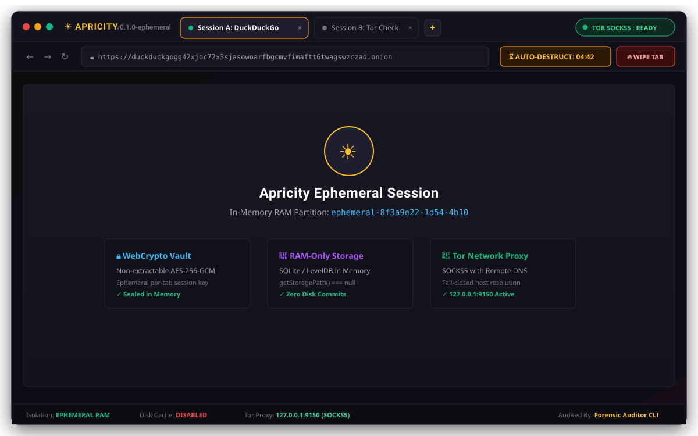
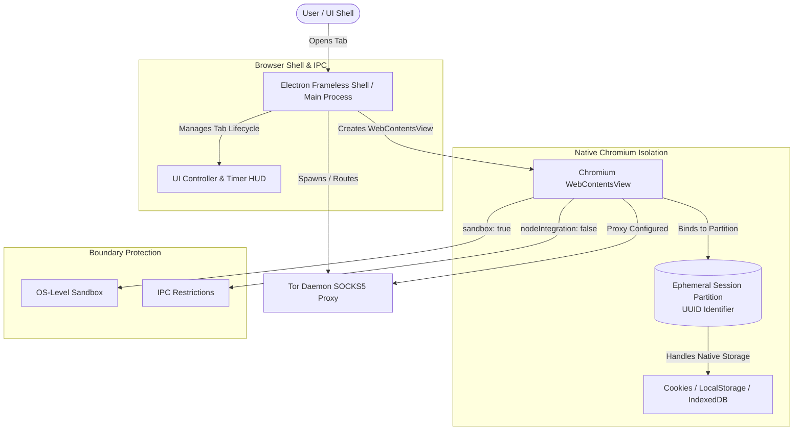

# ☀️ Apricity Browser

[](CHANGELOG.md)
[](LICENSE)
[](https://nodejs.org/)
[](tests/)
[](docs/threat-model.md)

> *An experimental desktop privacy browser exploring ephemeral session isolation, disposable browser state, controlled network proxy routing, and empirically tested session destruction.*

---

## 📸 Interface & Architectural Overview

<p align="center">
  
</p>

---

## 🌟 Why Apricity?

Standard web browsers treat privacy as an afterthought. Every time you browse the web, modern browsers leave persistent digital trails: cookie databases, DOM local storage, indexed databases, compiled code caches, and session history records committed to non-volatile disk. Even "incognito" or "private" modes frequently share process caches, persist DNS records, and retain state in memory long after tabs are closed.

**Apricity Browser reverses this paradigm by treating browser state as disposable and temporary.**

Every tab in Apricity is allocated an independent ephemeral session identity, isolated in memory, and routed through a controlled Tor SOCKS5 proxy with remote DNS resolution. When a tab reaches its user-configured countdown timer (or is closed manually), an automated teardown lifecycle executes: the WebContentsView is closed, in-memory partition stores and caches are cleared (`clearStorageData()` & `clearCache()`), and active renderer state is destroyed.

Rather than relying on unprovable marketing claims, Apricity pairs its architecture with an automated **Forensic Artifact Auditor** that deep-scans the filesystem to empirically measure what is destroyed and explicitly catalog what remains outside application control.

---

## 🏗️ Architecture

Apricity enforces defense-in-depth across the Electron main process, isolated WebContentsView guest renderers, and native Chromium ephemeral session partitions:



> **Architectural Boundary Note**: Web content (`document.cookie`, `localStorage`, `indexedDB`, `sessionStorage`, `CacheStorage`) executes directly on Chromium's native Blink engine in ephemeral partitions (`ephemeral-${UUID}`) with OS-level sandboxing (`sandbox: true`). It is isolated by Chromium partition engines and cleared via `clearStorageData()` and `clearCache()`.

---

## 🛡️ Security Properties Matrix

Apricity evaluates all security properties against empirical test evidence:

| Property | Status | Empirical Evidence & Architectural Justification |
|---|:---:|---|
| **Session Identity Isolation** | **VERIFIED** | Verified by `tests/test_electron_live.mjs` (UUID v4 generation and non-overlapping in-memory partition strings). |
| **Chromium Native Partition Storage** | **VERIFIED** | Verified by `tests/test_electron_live.mjs` (ephemeral partition allocation, cross-renderer cookie and localStorage isolation in RAM). |
| **Live DOM IndexedDB Isolation** | **NOT CURRENTLY TESTED** | Relies on Chromium partition separation in RAM; not currently covered by automated tests. |
| **Live DOM sessionStorage Isolation** | **NOT CURRENTLY TESTED** | In-memory tab construct; not currently covered by automated tests (no disk persistence guarantees). |
| **Session Destruction Lifecycle** | **VERIFIED** | Verified by `tests/test_electron_live.mjs` & `tests/test_forensic_auditor.mjs` (`clearStorageData()`, `clearCache()`, WebContentsView destruction). |
| **Level 3 Security Foundation** | **VERIFIED** | Verified by `tests/test_level3_security.mjs` (will-navigate bounds, window.open denial, IPC URL validation, will-download denial, safe DOM textContent, strict CSP, synchronous permission checks). |
| **Default Permission Denial** | **VERIFIED** *(API Layer)* | Verified by `tests/test_level3_security.mjs` (`setPermissionRequestHandler` configured to deny standard Web API requests). |
| **Tor SOCKS5 Proxy Configuration** | **UNVERIFIED / NOT CURRENTLY TESTED** | Automated Tor configuration and network isolation are scheduled for Level 4. |
| **Forensic Filesystem Absence** | **VERIFIED** *(Scanned Surface)* | Verified by `npm run forensic` (deep binary scan of 68 runtime files across userData and partition directories detected 0 residual canaries). |
| **Physical RAM & Heap Zeroization** | **NOT PROVIDED** | JS GC frees heap references for reuse; it does not physically zero deallocated memory (`UNVERIFIED_V8_HEAP_RAW_INACCESSIBLE`). |
| **Protection from Memory Dumpers** | **NOT PROVIDED** | Process memory can still be inspected by local process debuggers or root malware with elevated privileges. |
| **Absolute Anonymity via Tor** | **NOT PROVIDED** | Tor SOCKS5 proxy provides network pseudonymity, not mathematical anonymity against traffic correlation or fingerprinting. |
| **SSD Physical NAND Zeroization** | **UNVERIFIED** | Solid-state drive wear-leveling (FTL) writes out-of-place; physical cells are inaccessible (`UNVERIFIED_PHYSICAL_FTL_UNREACHABLE`). |
| **OS Virtual Memory Pagefile Exclusion** | **UNVERIFIED** | Host OS Kernel may page process RAM to `pagefile.sys` under memory exhaustion (`UNVERIFIED_KERNEL_PAGING_INACCESSIBLE`). |

---

## 🔬 Forensic Artifact Auditor

Apricity includes a built-in automated **Forensic Artifact Auditor** (`npm run forensic`) designed to experimentally verify session cleanup:

```bash
# Run standard forensic audit
npm run forensic

# Generate structured JSON report artifact
npm run forensic -- --out forensic-report.json

# Generate verbose Markdown report with technical justifications
npm run forensic -- --md --verbose
```

### How the Auditor Works:
1. **Isolated Test Environment**: Configures a dedicated temporary `userData` directory via `app.setPath('userData', tempDir)` before Electron session initialization. Asserts runtime path equality.
2. **Causal Disk-Backed Harness**: Uses a dedicated disk-backed partition (`persist:forensic-audit-<UUID>`) inside the temporary environment to allow empirical observation of disk persistence and subsequent cleanup (while production Apricity uses in-memory partitions).
3. **Canary Injection**: Generates high-entropy canary tokens across 5 storage subsystems (`COOKIE`, `LSTORE`, `SESSION`, `IDB`, `CACHE`) encoded in `UTF-8`, `UTF-16LE` (LevelDB/SQLite DOMStorage format), `ASCII`, and `hex`.
4. **Pre-Destruction Presence Validation**: Confirms canary existence during active session state in both browser storage and physical files (e.g. IndexedDB `.log` and Service Worker `CacheStorage` blobs).
5. **Destruction Execution**: Executes Apricity's teardown protocol (`clearStorageData`, `clearCache`, WebContentsView detachment and destruction).
6. **Deep Binary Sweep & Empty-Scan Guard**: Multi-encoding binary file scan across the exact same temporary `userData` tree. If scanned files or bytes equals 0, reports `UNVERIFIED — NO FILESYSTEM EVIDENCE AVAILABLE` rather than `VERIFIED CLEAN`.
7. **4-State Causal Breakdown**: Reports Browser Pre-State, Filesystem Pre-State, Cleanup Method, Filesystem Post-State, and Result per subsystem.

---

## 🧪 Automated Testing

Run the automated test suites covering WebContentsView architecture, live Electron execution, binary scanner precision, and adversarial stress tests:

```bash
# Run core test suites (Live Electron + Level 3 Security + Forensic Auditor)
npm test

# Run live Electron & Chromium runtime verification harness
npm run test:electron

# Run forensic auditor test suite
npm run test:forensic

# Run adversarial challenger stress test suite
npm run test:stress
```

---

## 📚 Security Documentation

For detailed technical specifications, threat models, and methodology papers:

* [**External Security Review & Claims Table**](docs/security-review.md): Final reviewer-oriented security evaluation matrix.
* [**Threat Model & Security Architecture**](docs/threat-model.md): Assets, threat actors, 6 security boundaries, and comprehensive threat specification.
* [**Security Properties Specification**](docs/security-properties.md): Formal breakdown of guaranteed vs non-guaranteed isolation properties.
* [**Forensic Audit Methodology**](docs/forensic-methodology.md): The 6-layer deletion continuum, SSD wear leveling (FTL), OS paging, NTFS journaling, and justification taxonomy.
* [**Release Notes v0.1.0**](docs/release-notes-0.1.0.md): Public experimental release summary.
* [**Changelog**](CHANGELOG.md): Historical record of versions and architectural additions.

---

## ⚠️ Known Limitations

1. **Hardware & SSD Wear Leveling**: Flash memory controllers write out-of-place. Unlinking operating system files does not guarantee immediate physical erasure of NAND flash cells.
2. **OS Memory Paging**: Under host RAM pressure, the operating system virtual memory manager may commit process memory to disk (`pagefile.sys` / `swapfile.sys`).
3. **V8 Heap Memory Remanence**: Garbage collection frees memory handles for V8 allocator reuse, but does not wipe raw bytes in physical RAM.
4. **Tor Stream Isolation**: Concurrent tabs share the default Tor daemon's circuit pool unless per-tab `IsolateSOCKSAuth` credentials are configured.

---

## 🗺️ Roadmap

Realistic future milestones based on the current architecture:

* [x] **Live Electron Chromium Test Harness**: Automated end-to-end Blink DOM storage testing in headless Electron windows.
* [ ] **Per-Tab Tor Stream Isolation**: Dynamically generate unique SOCKS authentication credentials (`IsolateSOCKSAuth`) per tab session to ensure isolated Tor circuit paths.
* [ ] **Native Memory Zeroization Addon**: Implement a lightweight C++ Node.js addon using platform-specific memory wipers (`SecureZeroMemory` / `explicit_bzero`) for cryptographic buffers.
* [ ] **Automated Tor Daemon Lifecycle**: Integrated cross-platform child process supervisor for standalone Tor binary initialization and teardown.

---

## 🚀 Installation & Development

### Prerequisites
* **Node.js** v18.0.0 or higher
* **Tor Browser** or standalone `tor` daemon (optional for unit tests, required for live Tor proxy routing)

### Getting Started

```bash
# 1. Clone the repository
git clone https://github.com/tejassachdeva2710/ApricityBrowser.git
cd ApricityBrowser

# 2. Install dependencies
npm install

# 3. Launch Apricity Browser
npm start

# 4. Run automated test suites
npm test

# 5. Run the live Electron verification harness
npm run test:electron

# 6. Run the forensic auditor
npm run forensic
```

---

## 🤝 Contributing

Contributions are welcome! Please read [**`CONTRIBUTING.md`**](CONTRIBUTING.md) for coding standards, test requirements, and our empirical honesty mandate.

---

## 📄 License

Licensed under the [MIT License](LICENSE).

## Forensic Verification

The auditor verifies the absence of known test canaries from the filesystem surfaces it scans after a real Chromium session is destroyed. It does not prove complete forensic absence from physical hardware.
